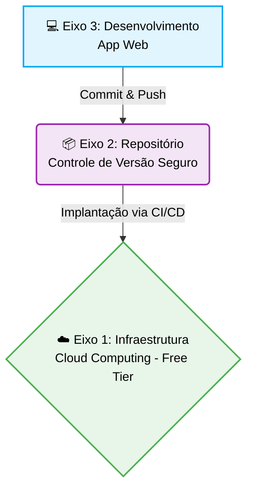
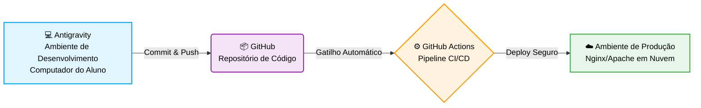

# 🎯 Escopo e Elementos Obrigatórios - *versão 1.0*


## 📌 Visão Geral da Atividade

Este documento estabelece as diretrizes técnicas e os artefatos obrigatórios para a avaliação final da disciplina de **Projeto Aplicado: Práticas de Mercado**. 

O objetivo é simular um ambiente de mercado real, aplicando os conceitos de *Secure by Design* e *Secure by Default* em todas as fases do ciclo de vida de uma aplicação. O projeto está estruturado em três eixos fundamentais, interligados por uma esteira de automação:



---

## ☁️ Eixo 1: Infraestrutura (Cloud Computing - Free Tier)

A aplicação desenvolvida deverá ser hospedada em um ambiente de nuvem pública, simulando a implantação de um serviço real.

### 🛠️ Requisitos de Hospedagem e Infraestrutura

* **Provedor Livre:** O aluno poderá optar por qualquer provedor de nuvem (AWS, Google Cloud, Azure, Oracle, etc.), desde que utilize os recursos gratuitos (*Free Tier*).
* **Sistema Operacional:** O sistema operacional utilizado no(a) servidor/VM/instância deverá ser obrigatoriamente **Ubuntu Server** ou **Debian**, em suas últimas versões estáveis disponíveis.
* **Responsabilidade e Operação:** Todas as etapas de criação e configuração do(a) servidor/VM/instância ficarão a cargo do aluno. Essas etapas farão parte direta da avaliação, cujo objetivo será comprovar a capacidade do aluno de conhecer e operar a console de um provedor de *cloud computing*.
* **Servidor Web:** O uso de Nginx ou Apache como Web Server será obrigatório.
* **Disponibilidade:** A aplicação web deverá estar acessível publicamente via internet por meio de um IP público (não será exigido domínio).

### 🛡️ Requisitos de Segurança (Critério de Aprovação - *Metas mínimas obrigatórias a serem alcançadas*)

* **Acesso Remoto Seguro:** O acesso administrativo ao servidor/VM/instância deverá ser feito obrigatoriamente por meio de **chaves SSH**, devendo ser desabilitada a autenticação por senha padrão.
* **Firewall / Security Groups (Least Privilege):** A infraestrutura deverá expor **apenas** as portas estritamente necessárias para o funcionamento da aplicação (ex: 80 para HTTP ou 443 para HTTPS). A porta de gerência 22 do SSH deverá estar sob a proteção de Fail2Ban com tolerância de 4 erros e banimento por 24 horas.
* **Criptografia e Certificado (HTTPS):**
* A configuração de HTTPS via Certbot (versão 5.4 ou superior) com suporte a emissão de certificados SSL/TLS para endereços IP públicos diretamente pela [Let's Encrypt](https://letsencrypt.org/2026/01/15/6day-and-ip-general-availability) deverá ser realizada. Deverá ser utilizada a opção de autorrenovação (automática), se disponível.
* O servidor web (Nginx ou Apache) deverá ser configurado para realizar o **redirecionamento automático** de todo o tráfego HTTP para HTTPS.
* * Para o caso de uso de IP como endereço de acesso: A configuração SSL/TLS do servidor deverá ser submetida ao teste [SSL.org - SSL Certificate Checker](https://www.ssl.org/), devendo obrigatoriamente possuir **Certificate Trusted: YES e Algorithm / Key Type & Size: Good signature · Acceptable key** e apresentar o suporte a PQC (Post-Quantum Cryptography) ativado por meio de um segundo teste [Digicert - TLS quantum readiness check](https://www.digicert.com/pqc-checker).
* Para o caso de uso de domínio como endereço de acesso: A configuração SSL/TLS do servidor deverá ser submetida ao teste [Qualys SSL Labs - SSL Server Test](https://www.ssllabs.com/ssltest/), devendo obrigatoriamente obter **nota A** e apresentar o suporte a PQC ativado (*This server supports PQC (Post-Quantum Cryptography) key exchange*).


---

## 📦 Eixo 2: Repositório (Hospedagem e Versionamento)

O controle de versão é o coração do ciclo de desenvolvimento seguro. O aluno deverá criar um repositório para o projeto.

### 🛠️ Requisitos de Versionamento

* **Plataforma:** O código-fonte deverá estar hospedado exclusivamente em uma conta gratuita do [GitHub](https://github.com/), e o repositório deverá obrigatoriamente possuir **acesso público**.
* **Responsabilidade e Operação:** A criação da conta no GitHub e sua configuração segura ficarão inteiramente a cargo do aluno. Essas etapas farão parte da avaliação, exigindo que o aluno aplique práticas de segurança na própria plataforma, como a configuração de chaves SSH ou *Personal Access Tokens* (PAT) para as operações de *commit* e *push*, além da recomendação de ativar a Autenticação em Duas Etapas (2FA) em sua conta.
* **Organização Básica:** O repositório deverá conter todos os artefatos do Eixo 3 e um arquivo `README.md` detalhado (que servirá como relatório técnico da entrega).

### 🛡️ Requisitos de Segurança (Critério de Aprovação - *Metas mínimas obrigatórias a serem alcançadas*)

* **Prevenção de Vazamento de Dados (Obrigatório):** O repositório deverá fazer o uso correto do arquivo `.gitignore`. Será proibido o *commit* de arquivos `.env`, chaves privadas de SSH, credenciais de acesso à Cloud, senhas hardcoded ou bancos de dados locais.
* O vazamento de credenciais reais no repositório acarretará penalidade imediata na avaliação, refletindo as consequências severas dessa prática no mercado.

---

## 💻 Eixo 3: Desenvolvimento (Protótipo de Software Web)

O foco deste eixo é a aplicação prática de *Secure by Design*, sem a sobrecarga de arquiteturas complexas. Não haverá exigência de banco de dados, nem obrigatoriedade de separação entre Front-end e Back-end.

### 🛠️ Requisitos Funcionais e Tecnológicos

* **Pilha Tecnológica Livre:** O aluno terá total liberdade de escolha. Poderá utilizar JavaScript, Java, Python, HTML/CSS, Angular, React ou qualquer outra linguagem/framework. Soluções desenvolvidas apenas no Front-end serão plenamente aceitas.
* **Codificação Assistida por IA:** As ações de desenvolvimento deverão obrigatoriamente utilizar inteligência artificial para a escrita e auditoria do código. O ambiente de desenvolvimento (IDE) indicado para este fim é o [Google Antigravity](https://antigravity.google/product/antigravity-ide/).
* **Responsabilidade e Operação:** A correta instalação, configuração inicial e operação da ferramenta IDE Antigravity (ou ambiente similar baseado em IA) ficarão a cargo do aluno. O domínio na interação com o assistente inteligente para a geração de código seguro, depuração e refatoração fará parte da avaliação, simulando o fluxo de trabalho moderno de um desenvolvedor no mercado.
* **Estrutura Mínima Exigida:** O protótipo web deverá obrigatoriamente possuir:
* Uma tela de Login.
* Uma página interna (acessível apenas após autenticação).
* Um botão de Logout funcional.


### 🛡️ Requisitos de Segurança (Critério de Aprovação - *Metas mínimas obrigatórias a serem alcançadas*)

O código-fonte entregue deverá mitigar ativamente, no mínimo, **3 (três) vulnerabilidades** listadas no documento oficial da [OWASP Top 10:2025](https://owasp.org/Top10/2025/).

* **Comprovação:** O aluno deverá documentar no `README.md` do seu repositório quais foram as 3 categorias da OWASP escolhidas e apontar onde/como o código as prevenirá (ex: implementação de tokens, sanitização de inputs na tela de login, etc.).

---

## 🔄 Eixos 1, 2 e 3: Integração e Entrega Contínuas (CI/CD)

Para refletir a realidade do mercado de tecnologia, o fluxo de implantação da aplicação deverá ser integrado e automatizado.

### 🛠️ Fluxo Ilustrativo de Implantação

A aplicação deverá sair do **Antigravity** (ambiente de desenvolvimento), ir para o **GitHub** (repositório) e, por fim, ser repassada de forma automatizada ao **Ambiente de Nuvem** escolhido, onde o sistema operacional e o servidor Web estarão prontos para servir a página (ambiente de produção).

Esse ciclo deverá ser feito obrigatoriamente por meio de ferramentas de CI/CD utilizando o recurso *Actions* no GitHub.



### 🛡️ Responsabilidade e Operação

A criação, configuração e validação da pipeline no GitHub Actions ficarão inteiramente a cargo do aluno. Esta etapa envolverá a elaboração do arquivo de configuração (*workflow* em formato `.yml`) e o gerenciamento seguro das credenciais necessárias para a comunicação entre o GitHub e a Nuvem. O aluno deverá garantir o uso do recurso de *Secrets* do GitHub para armazenar chaves de acesso (como chaves SSH do servidor), garantindo que nenhuma credencial fique exposta no código da pipeline.

### 🛡️ Requisitos de Segurança (Critério de Aprovação - *Metas mínimas obrigatórias a serem alcançadas*)

* Pipeline no GitHub Actions automatizando, enviando o código para produção assim que o comando "git push origin main" for executado no ambiente de desenvolvimento (computador do aluno).

---

## ✅ Checklist Final de Entrega

Antes de submeter o projeto, verifique se:

* [ ] A aplicação web está no ar e acessível por um IP público (Eixo 1).
* [ ] O Web Server (Nginx ou Apache) está configurado com HTTPS (Certbot/Let's Encrypt) e redireciona o tráfego HTTP para HTTPS automaticamente (Eixo 1).
* [ ] O teste no Qualys SSL Labs retornou **Nota A** e confirma a ativação do PQC (Eixo 1).
* [ ] O acesso à nuvem utiliza boas práticas (uso de chave SSH e Fail2Ban configurado para a porta 22) (Eixo 1).
* [ ] O código está versionado em um repositório público no GitHub e a conta está devidamente configurada (Eixo 2).
* [ ] O `.gitignore` está configurado e não há chaves/senhas expostas no código (Eixo 2).
* [ ] A aplicação possui Login, Página Interna e Logout, e foi desenvolvida com o auxílio de IA via IDE Antigravity ou equivalente (Eixo 3).
* [ ] O `README.md` explica claramente quais foram os 3 itens do OWASP Top 10 mitigados e onde encontrá-los no código (Eixo 3).
* [ ] O fluxo de implantação está devidamente automatizado com CI/CD utilizando o GitHub Actions (Integração e Entrega Contínuas).

```

```
